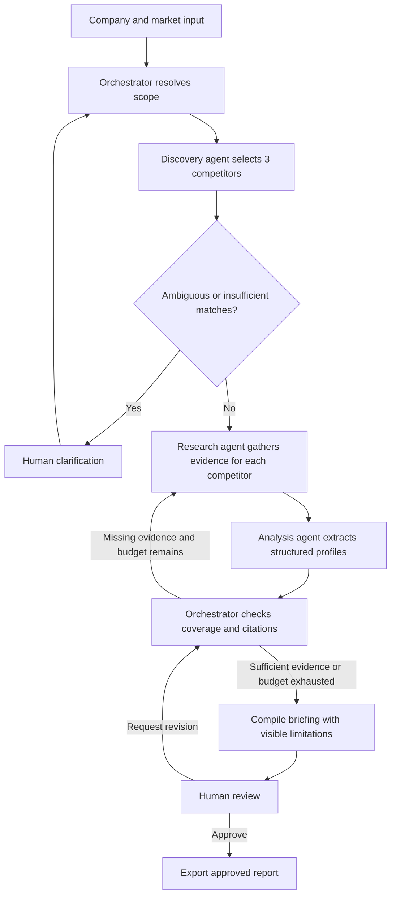

# Week 3: CreatorKit AI implementation plan

Status: CreatorKit AI MVP implemented: research agents, evidence checks, LangGraph persistence/review, Streamlit UI, and approved exports. See docs/LIVE_RUN_REVIEW.md for the unapproved live sample. Human review, broader live evaluation, and external submission remain.
Source: `Week 3 Project Handout (Aug 2026).pdf`, all 10 pages reviewed.
Selected scope: Project 3A, Competitor Analysis; Track 2, Python + LangChain + LangGraph.

## 1. Page-by-page requirements

| Page | Contents and relevance |
| --- | --- |
| 1 | Build an agent that chooses next steps, calls tools, maintains state, recovers from errors, and hands off to humans. Lists August 30, 2026 for Builder of the Week and September 16, 2026 for final certification. |
| 2 | Project 3A: discovery agent finds top 3 competitors using You.com Search; research agent gathers fresh web/news evidence; analysis agent extracts pricing, features, positioning, and recent news; orchestrator delegates and compiles briefings. |
| 3 | Continuation of 3A: You.com is the primary search source; simple interface such as Streamlit; working formatted briefings and sample output for 2-3 competitors; demo and GitHub link or zip. Other use cases begin. |
| 4 | Project status and GTM use cases. Their persistent trend memory, document ingestion, and vector-store requirements do not apply to 3A. |
| 5 | Code review and IT support voice use cases; outside our scope. |
| 6 | Write a project one-liner. Measure task completion, explicitly design memory, and default business write actions to human approval. Detailed framework is optional. |
| 7 | Framework: goal, surface, ordered steps, tools, memory, limits, human review, error recovery, and success measure. |
| 8 | Code track: LangChain tools/agents, LangGraph state, checkpointers, interrupts, and LangSmith tracing/evals. Nebius wording is permissive ("may"), not a mandatory provider restriction. |
| 9 | Submit a Google Doc, video of 5 minutes or less, and code on GitHub. Document overview, datasets, AI coding prompts, iterations, and learnings. Demonstrate failure recovery and human review. |
| 10 | Links to reference solutions, with a warning against replication. Design this project independently; reference solutions were not opened. |

The page references in the introduction are inconsistent with the actual PDF: the framework is on pages 6-7, and Project 3A starts on page 2.
The general submission instructions request GitHub, although Project 3A also permits a zip; plan for GitHub to satisfy both.

## 2. Selected product and success target

The product-specific inputs, outputs, demo persona, and decision rules are defined in [CreatorKit AI scope](docs/CREATORKIT_SCOPE.md). These specialize the generic research architecture below.

One-liner: CreatorKit AI helps aspiring creators and small businesses choose affordable content-creation software by researching three alternatives to a shortlisted tool and comparing evidence-backed pricing, features, positioning, restrictions, and news against the user's goals, device, and budget, with human review before final export.

The time and success thresholds are proposed evaluation targets, not measured results or handout requirements. Measure the manual baseline with a sample task; do not claim an invented time saving.

### Inputs

- Company name and preferably its official website.
- Optional product/category, customer segment, and geography to define the competitive market.
- News lookback window (proposed default: 90 days).
- Fixed target of three competitors in the first version.

### Outputs

- Executive summary and rationale for the three selected competitors.
- Side-by-side comparison of pricing, core features, target customers, and positioning.
- Per-competitor recent news with publication dates and links.
- Evidence references, retrieval timestamps, missing information, and conflicting claims.
- Human-reviewed Markdown briefing and structured JSON export.

PDF export, recurring monitoring, login, deployment, vector search, and more agent roles are later enhancements. They are not needed for the initial submission.

## 3. Agents and control flow

| Role | Responsibilities | Structured output |
| --- | --- | --- |
| Orchestrator | Resolve scope; dispatch specialists; inspect evidence coverage; request targeted follow-up; compile the briefing; pause for human input. | Research plan, next action, reason, final briefing |
| Discovery agent | Search You.com for candidate competitors; rank by product overlap, customer overlap, and geography; deduplicate domains; select three with supporting evidence. | Competitor identities, domains, relevance reasons, source IDs |
| Research agent | Choose queries for each competitor; gather official pricing/product pages and recent news; follow up on missing evidence within limits. | Source records grouped by competitor and research dimension |
| Analysis agent | Extract evidence-supported facts and comparisons; normalize pricing units; identify contradictions and gaps. | Validated competitor profiles and follow-up requests |

These are four logical agent roles; they can share one model provider. The research and analysis roles can be reused for each competitor. A fixed graph provides guardrails, while model decisions select queries and evidence-driven follow-ups.



Start with sequential competitor processing to simplify debugging. Bounded parallel processing is an optimization after the full workflow and recovery work.

## 4. Tools and technology

- Python, LangChain for model/tool integration, LangGraph for state and routing.
- Pydantic models for tool responses, competitor profiles, and validated outputs.
- You.com HTTP adapter: use the current documented POST `/v1/search` API. Preserve web/news results and provenance; use extraction for supporting page content where available. Keep API-specific response mapping in one module.
- Four tool contracts: `search_web` (read), `search_news` (read), `read_page` (read), and `export_briefing` (write, approved only). Both search tools wrap You.com; page reads can use provider extraction/Contents after verifying its contract during implementation.
- Streamlit for inputs, progress, review, and downloads.
- SQLite-backed LangGraph checkpoints for local durable runs. Verify/pin compatible dependency versions during setup.
- Local structured event logs for graph transitions, tools, errors, and duration; optional LangSmith tracing.
- A configurable tool-capable LLM with structured output support. Provider/model selection depends on available credentials and a small compatibility smoke test. Nebius/Fireworks are options mentioned in the handout, not mandatory dependencies.

Current references checked during planning:
- [You.com Search](https://you.com/docs/api-reference/search/v1-search)
- [LangGraph persistence](https://docs.langchain.com/oss/python/langgraph/persistence)
- [LangGraph interrupts](https://docs.langchain.com/oss/python/langgraph/interrupts)
- [Streamlit session state](https://docs.streamlit.io/develop/concepts/architecture/session-state)

## 5. State, evidence, and approval

Persist a run ID, input/scope, selected competitors, research plan, source registry, extracted profiles, coverage gaps, attempts, tool/model usage, current phase, draft, human feedback, and approval status. Store each competitor's results by stable competitor ID to avoid overwriting another profile.

SQLite is the source of truth for resumable runs. Streamlit session state holds the active run ID and display choices. Provide a run selector so a browser refresh or app restart can reconnect to saved work. Retain runs locally until explicit deletion; report age stays visible, and new runs fetch fresh evidence.

Each source contains ID, URL, title, publisher/domain, retrieval time, publication date when known, and supporting passages. Each factual claim references source IDs. Pricing retains currency, billing period, per-seat/unit basis, and annual-billing conditions. Missing pricing is "not found" unless a source explicitly states "contact sales". Undated news must not be presented as verified recent news.

Verify source IDs mechanically, and separately assess whether the cited passage supports the claim. Prefer official pages for pricing/features and dated primary announcements or reputable reporting for news. Label comparative positioning inferences separately from sourced facts.

Human intervention occurs for ambiguous company/market scope, unresolved failures, and final report approval. Allow edits, targeted re-research, approval, or cancellation. Final report export occurs only after approval; revision invalidates prior approval. Internal checkpoints/logs run automatically as disclosed operational persistence, distinct from approval of a final business artifact.

LangGraph interrupts and durable checkpoints implement pauses. Keep final export in a separate, idempotent step after approval so resuming cannot duplicate side effects.

## 6. Limits and recovery

Proposed configurable defaults: at most 30 search requests, two additional evidence-gathering passes, three total attempts for transient network failures, and a 10-minute execution budget excluding human wait time. Enforce limits in code rather than prompts.

| Condition | Behavior |
| --- | --- |
| Empty search | Reformulate once; ask for market clarification or return explicitly partial results if still insufficient. |
| Timeout, rate limit, temporary server error | Bounded backoff; respect Retry-After; retain completed work. |
| Invalid credentials or exhausted quota | Pause with actionable error; resume the same run after configuration is fixed. |
| Blocked page | Try another public source; mark snippet-only evidence and uncertainty. |
| Malformed model output | Schema validation and one repair attempt; then controlled failure. |
| Conflicting prices | Retain both with source dates and billing context; flag for review. |
| No recent news | State none was found in the selected period. |
| Fewer than three credible competitors | Ask for scope adjustment; do not fabricate the missing competitors. |
| Budget exhausted | Present partial briefing with explicit missing fields and review options. |
| Restart during a run | Resume from the last durable checkpoint. |

Treat retrieved web text as evidence, never as instructions. Do not let page content change tool permissions or trigger writes. Keep API keys out of prompts, logs, and Git; constrain URL fetching to public HTTP(S) destinations if implementing a direct fetcher.

## 7. Build sequence and acceptance gates

1. **Foundation:** environment, locked dependencies, configuration, `.env.example`, schemas, and You.com/model smoke tests. Gate: a real search and structured model response work.
2. **One-competitor vertical slice:** search -> evidence -> profile -> cited Markdown. Gate: a reviewer can verify a price, a feature, and a positioning statement against the evidence, or see explicit unknowns.
3. **Full multi-agent graph:** discovery, three competitors, orchestration decisions, bounded follow-up, and consolidated briefing. Gate: trace shows delegation and at least one evidence-driven routing decision.
4. **State and human review:** durable checkpoints, interrupts, corrections, resume, and approved export. Gate: restart during a pause preserves evidence and approval status; rejected drafts cannot export as approved.
5. **Streamlit interface:** input form, progress, competitor comparison, evidence panel, review controls, run history, and downloads. Gate: complete the task without using a terminal after launch.
6. **Failure tests and evaluation:** test tool failures, missing evidence, schema errors, interruption/resume, and budget exhaustion. Gate: controlled recovery or useful partial results, with no fabricated claims.
7. **Submission package:** README, sample results covering three competitors, evaluation notes, Google Doc content, coding-prompt/iteration log, and demo script of five minutes or less.

Prioritize these gates in order if the submission window is still open; defer cosmetic work and optional integrations.

## 8. Suggested repository structure

```text
app.py
src/market_research/
  config.py
  schemas.py
  state.py
  graph.py
  agents/                 # orchestrator, discovery, research, analysis
  tools/                  # You.com adapter, page evidence, approved export
  storage.py
  reporting.py
tests/                    # graph, grounding, failure and resume checks
evals/                    # cases, rubric, measured results
examples/                 # actual sample reports and JSON
docs/                     # architecture, coding log, submission text, demo script
.env.example
.gitignore
pyproject.toml
README.md
```

## 9. Evaluation and submission checklist

Use a ten-case evaluation set spanning clear company identities, ambiguous names, regional scope, opaque pricing, sparse news, and conflicting evidence. Use recorded fixtures for reproducible failure tests and real API runs for freshness/integration checks. Clearly label fixture-based demonstrations.

Proposed usable-run rubric: three relevant competitors (human assessed), all four requested dimensions present or explicitly unknown, sourced factual claims, no invented prices/news, and a readable reviewed report within the target time. Report usable runs out of ten and explain failures; do not report targets as achieved.

Additional required demonstrations: retry after a transient tool error, resume after restart, edit/reject at review, and a partial result after budget exhaustion. Capture latency, request counts, token usage when available, citation coverage, and factual correctness separately.

Submission checklist:
- [ ] Working local agent and reproducible setup instructions.
- [ ] Formatted sample output for 2-3 competitors (target three).
- [ ] GitHub repository link, with no credentials or private runtime data.
- [ ] Google Doc: overview, architecture, web/news data sources, AI coding prompts, iterations, evaluation, limitations, and learnings.
- [ ] Video <=5 minutes showing live input, progress/delegation, final result, citations, human review, and concise recovery evidence; explain use of AI coding tools.
- [ ] Submit using the handout's form: https://forms.gle/HMgTU7zy6UJ8XkJX6.

## 10. Decisions needed before live implementation

Selected product: CreatorKit AI. Proposed demo anchor: Canva for short-video creation, serving a home baker in India. OpenAI is selected; gpt-4.1-mini generation and You.com search have both been verified. You.com and model API credentials must be configured locally; do not put secret values in project documentation. The workflow can be scaffolded and fixture-tested before credentials are available.

Environment update: Python 3.13 virtual environment and uv.lock created; dependencies installed; Streamlit 1.64 documentation discovered; five configuration tests and the offline LangGraph/SQLite checkpoint check passed.
