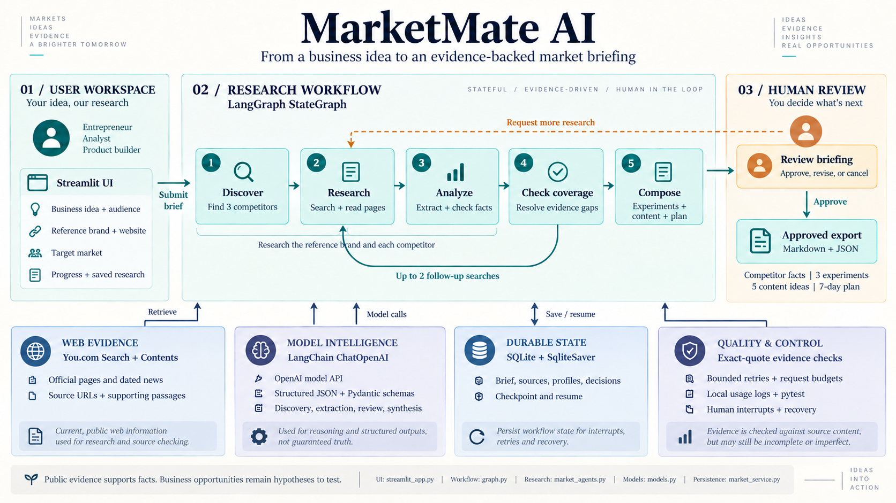

# MarketMate AI

A local market-research assistant for small-business founders. Research a reference brand and three competitors, then explore sourced product and positioning facts, differentiation experiments, five content concepts and a proposed first-week plan.

Built for Week 3 Project 3A with Python, LangChain, LangGraph, You.com and OpenAI.

Facts and proposals are separate: suggestions are hypotheses to test, not proven demand. Missing optional prices or news do not block other findings. Human review is required before export.

See [product scope](docs/MARKETMATE_SCOPE.md) and [submission draft](docs/SUBMISSION_DRAFT.md). New runs are stored in data/marketmate.

## Architecture



The workflow discovers competitors, gathers and checks evidence, and prepares a briefing for human review. LangChain connects to the OpenAI model, while LangGraph manages routing, follow-up research, pauses, and saved progress. Approval enables Markdown and JSON export.

[View the full-size diagram](docs/images/marketmate-architecture.png) or read the [technical architecture](docs/ARCHITECTURE.md).

## Setup (PowerShell)

Python 3.13 and uv are used locally. The exact dependency resolution is in uv.lock.

```powershell
uv sync --locked
```

For a fresh clone only, copy .env.example to .env. Do not overwrite existing credentials.

```dotenv
YDC_API_KEY=
OPENAI_API_KEY=
OPENAI_MODEL=gpt-4.1-mini
```

Settings load from the project-root .env. Environment variables take precedence.
Keys are masked by the settings model and never included in saved research state.
Never print get_secret_value() or save real keys in notebooks.

## Run

```powershell
uv run --locked streamlit run streamlit_app.py --server.address 127.0.0.1
```

Open http://127.0.0.1:8501. Fill the brief, start research, and review the evidence before approving.
Use the sidebar to reopen a saved run. After a restart, use Resume saved research.
If a run is paused for an API error, fix the local configuration or provider quota and choose Retry failed step.
Completed research is kept; the interrupted node may repeat its unfinished work.

For a terminal-based live research run (uses API credits and pauses for review):

```powershell
uv run --locked python -m market_research.cli
```

Review this run in the web app. The CLI does not automatically approve reports.

## Checks

```powershell
uv run --locked python -m market_research.check_setup
uv run --locked pytest -q
uv run --locked ruff check src tests streamlit_app.py
uv run --locked ruff format --check src tests streamlit_app.py
uv pip check
```

Tests use fake credentials, mock HTTP responses, and synthetic evidence; they do not incur API charges.
The offline setup check verifies configuration, imports, and a LangGraph/SQLite checkpoint round-trip.

## Scope and limits

- Competitor research for a business idea, audience and target market.
- Three competitors plus the reference brand. Missing/ambiguous discovery pauses for clarification.
- At most 30 search requests and 36 model requests per run, including retries. At most two autonomous follow-up searches and two user revision rounds.
- A 10-minute active-execution budget per invocation, excluding human waiting. Persistent request counters apply across retries and restarts.
- API requests cost money. Request limits bound usage but are not an exact currency spending cap.
- A source record keeps up to 16,000 characters; the graph selects up to 12 records and an analysis call receives at most four 8,000-character excerpts.
- Optional missing prices do not block synthesis. Experiments and content concepts are proposals, not verified demand.
- News requires a source metadata date inside the chosen window. Missing metadata can exclude otherwise relevant announcements.
- Evidence matching and a second model pass reduce errors; they do not guarantee factual accuracy.
- No purchasing, signup, publishing, or cancellation. No automatic final approval.
- Local single-user app; bind to localhost. Authentication and multi-user deployment are not implemented.

## Local data

data/marketmate/marketmate.sqlite stores checkpoints, source passages, run history, and sanitized event logs.
data/marketmate/exports/<run-id>/ holds approved exports. These files are ignored by Git.
Run data remains locally until explicitly removed. Do not delete the database while the app is running.
Fresh runs fetch new evidence; old reports retain their original retrieval dates.

## IDE and Jupyter

Select .venv/Scripts/python.exe as the Python interpreter and notebook kernel.
ipykernel is installed; a global kernel registration is unnecessary.

## Repository guide

- streamlit_app.py: input, comparison, evidence, history, review, and download UI.
- src/market_research/market_schemas.py: business brief, checked facts, and proposed actions.
- tools.py: bounded You.com search with extraction.
- models.py and market_agents.py: structured model calls, specialist roles and evidence checks.
- market_reporting.py: sourced competitor report and labeled experiments.
- graph.py: research routing, bounded follow-up, interrupts, and recovery.
- market_service.py and runtime.py: SQLite lifecycle, history, and usage limits.
- reporting.py: Markdown rendering and approval-gated exports.
- tests/: offline evidence, failure, persistence, budget, and UI tests.
- docs/MARKETMATE_SCOPE.md: current product scope.
- docs/ARCHITECTURE.md: technical design.
- docs/SUBMISSION_DRAFT.md: documentation outline and demo script.
- docs/BUILD_LOG.md: implementation decisions and validation notes.

## Demo and submission

See [readiness review](docs/DEMO_READINESS.md), [sample draft](examples/sample-briefing.md), and [submission document](docs/SUBMISSION_DRAFT.md). The sample has three competitors plus a reference brand. Missing prices/news are explicitly disclosed.

GitHub: https://github.com/shinderupesh15/marketmate-ai
