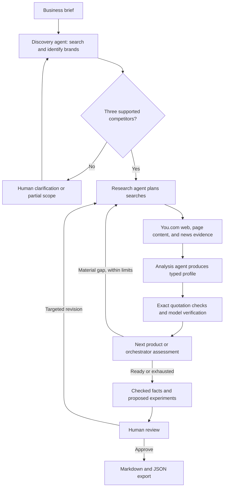

# MarketMate AI architecture

The graph uses MarketAgents with BusinessBrief, BusinessProfile and MarketPlan. Runs live in data/marketmate/marketmate.sqlite. The app uses the self-contained MarketService.

## Workflow

All four roles share a configurable OpenAI model through LangChain. LangGraph controls routing and state.
The graph has bounded autonomy: agents select queries and the orchestrator decides whether another search is worth doing.
No multi-agent background processes or external orchestration accounts are required.

## Persistence and recovery

LangGraph uses a SQLite checkpointer and a stable run ID. Research input, selected competitors, evidence, profiles, current target, counters, errors, and approval are serialized as JSON-compatible state.
Provider keys live only in the configuration/client layer, never in checkpoints.

A separate events table journals request reservations before calls, so a process restart cannot reset a run's request allowance.
Query batches checkpoint at node boundaries. Work in a node interrupted by process termination may run again.
SQLite checkpoints do not imply exactly-once remote API calls.

Human interrupts handle ambiguous discovery, provider failures, and report approval.
Exports require both approved=true and status=approved and use atomic file replacement for repeatable saves.
A revision returns to research and leaves the report unapproved.

## Evidence rules

Every claim has a source ID and an exact supporting passage. Matching is case/whitespace normalized.
Invalid or missing references invalidate the field. A separate structured model call checks whether the field's meaning and attribution follow from the source.
Model verification is fallible and is described as a check, not a guarantee.

Published news dates must match source metadata and be within the configured window.
The registry retains retrieval dates and whether evidence came from an excerpt or extracted page content.
Published price examples retain their source wording and context. They are optional.

MarketMate does not score brands against purchase constraints. It generates pre-launch experiments and content concepts from a catalog of checked facts. The synthesis schema restricts fact references to catalog IDs; those IDs resolve to company fields and source passages in the report. Ideas remain hypotheses even when their research basis is supported.

Analysis sends at most four source excerpts of 8,000 characters each to the model. The complete collected source registry remains in the saved run. Transient OpenAI rate-limit errors get one bounded retry; persistent access/quota errors pause research.

## Deliberate first-version limits

Local single-user use, sequential competitor processing, no automatic purchase or external publication, no scheduled monitoring.
The interface does not prove demand, generate finished products, or conduct customer research on the user's behalf.
Historical snapshots and cross-run constraint-only recomputation are future enhancements.
